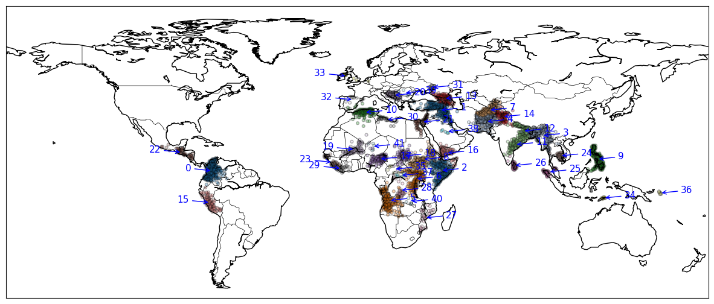
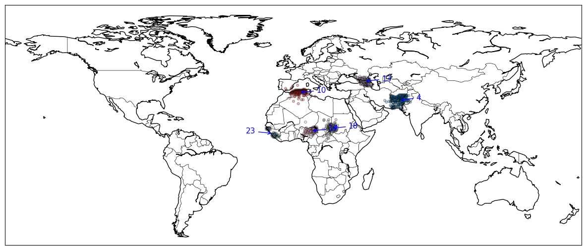
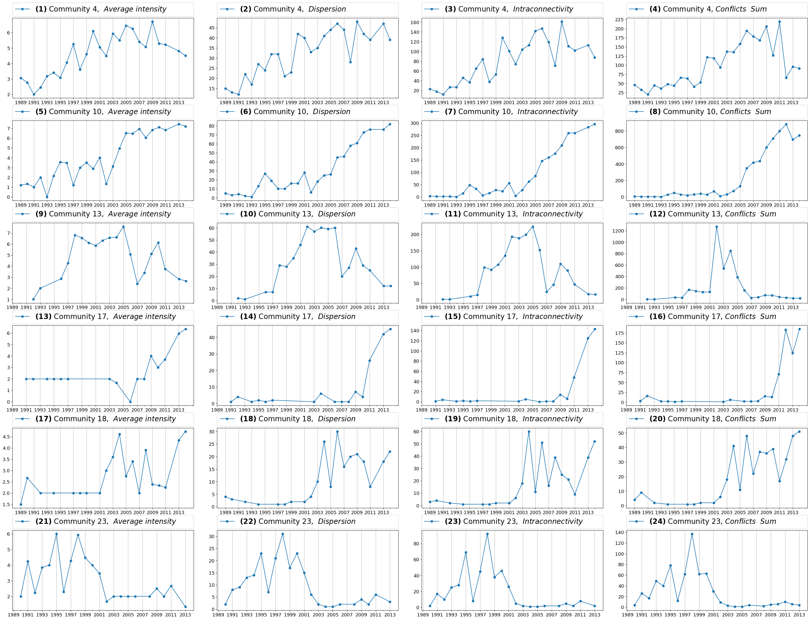
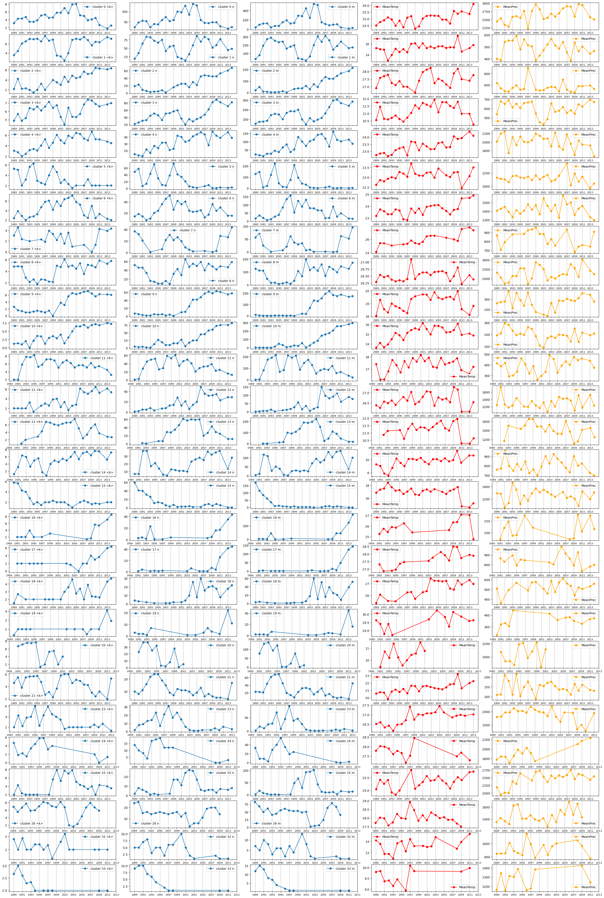
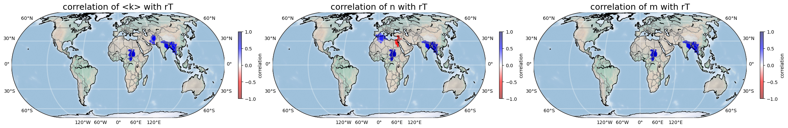
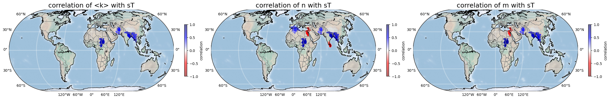
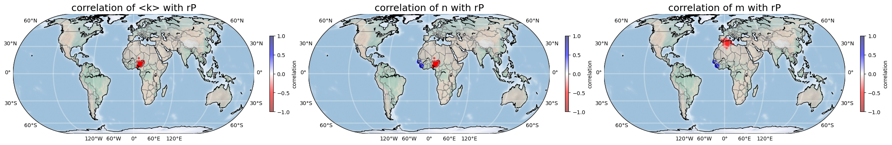
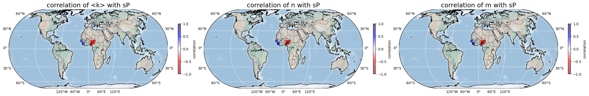

# Measuring Spatiotemporal Civil War Dimensions Using Community-Based Dynamic Network Representation (CoDNet)

## How to use it and examples 

This is a notebook showing the code of the proposed method for CoDNet, which was employed for the analysis of Spatiotemporal Civil [1]. The code is in Python 3.9, and some toolboxes are necessary to run the commands. 

[1] Vega-Oliveros, D. and Koren, O., "Measuring Spatiotemporal Civil War Dimensions Using Community-Based Dynamic Network Representation (CoDNet)," in IEEE Transactions on Computational Social Systems, vol. 11, no. 1, pp. 1506-1516, Feb. 2024, doi: 10.1109/TCSS.2023.3241173.

[2] Koren, Ore, 2023, "Measuring Spatio-Temporal Civil War Dimensions Using Community-Based Dynamic Network Representation (CoDNet)", https://doi.org/10.7910/DVN/0S9AFT, Harvard Dataverse, V1

The following very common packages are necessary for running the code:

* numpy
* pandas
* networkx
* sklearn
* basemap
* igraph
* leidenalg
* networkx

We provide the next environment installation commands (in Anaconda) to facilitate reproducibility:

```
conda create -n codnet python=3.9
conda activate codnet
conda install conda-forge::basemap
conda install anaconda::scikit-learn
conda install -c conda-forge python-igraph
conda install conda-forge::leidenalg
conda install anaconda::networkx
```

After cloning the repository, the first step is to extract the files from the compressed folder **_data.7z_**.
Then, make sure that you have in the root repository the **data** folder, which contains three files:
+ conf_data.csv
+ gridtemp8914.csv
+ prec_dat.csv

```python
import matplotlib.pyplot as plt
import sys,os
import numpy as np
import pandas as pd
import networkx as nx
import graphConstruction as gc
from codnet import codnet
from communitiesTS import communityTS
```


```python
event = 'state'    
neighbors = 3
timeWindow = 'month' #For month or year sliding window
MAX_DISTANCE = 500 #MAX_DISTANCE=[100, 250, 500] km
#cols columns of metrics: ['n',"n_norm_comm","m","<k>","<s>","lo",'tmp_i','pre_i','tmp_mean_community','pre_mean_community'] 
cols =  ["<k>",'n', "m"] 
codnets = codnet()
```


```python
gc.contructYearsNetworks(event,neighbors,MAX_DISTANCE,timeWindow = timeWindow)
codnets.contructConsolidateYearNetwork(neighbors, MAX_DISTANCE, timeWindow = timeWindow)
```

    Creating 8 workers processing  4  jobs
    net-year_1989_neighbors_3_MAX_DISTANCE_500_month_.gml
    net-year_1990_neighbors_3_MAX_DISTANCE_500_month_.gml
    net-year_1991_neighbors_3_MAX_DISTANCE_500_month_.gml
    net-year_1993_neighbors_3_MAX_DISTANCE_500_month_.gml
    net-year_1992_neighbors_3_MAX_DISTANCE_500_month_.gml
    net-year_1994_neighbors_3_MAX_DISTANCE_500_month_.gml
    net-year_2001_neighbors_3_MAX_DISTANCE_500_month_.gml
    net-year_1997_neighbors_3_MAX_DISTANCE_500_month_.gml
    net-year_1995_neighbors_3_MAX_DISTANCE_500_month_.gml
    net-year_1998_neighbors_3_MAX_DISTANCE_500_month_.gml
    net-year_2002_neighbors_3_MAX_DISTANCE_500_month_.gml
    net-year_1996_neighbors_3_MAX_DISTANCE_500_month_.gml
    net-year_2003_neighbors_3_MAX_DISTANCE_500_month_.gml
    net-year_1999_neighbors_3_MAX_DISTANCE_500_month_.gml
    net-year_2005_neighbors_3_MAX_DISTANCE_500_month_.gml
    net-year_2009_neighbors_3_MAX_DISTANCE_500_month_.gml
    net-year_2000_neighbors_3_MAX_DISTANCE_500_month_.gml
    net-year_2006_neighbors_3_MAX_DISTANCE_500_month_.gml
    net-year_2004_neighbors_3_MAX_DISTANCE_500_month_.gml
    net-year_2010_neighbors_3_MAX_DISTANCE_500_month_.gml
    net-year_2013_neighbors_3_MAX_DISTANCE_500_month_.gml
    net-year_2017_neighbors_3_MAX_DISTANCE_500_month_.gml
    net-year_2007_neighbors_3_MAX_DISTANCE_500_month_.gml
    net-year_2011_neighbors_3_MAX_DISTANCE_500_month_.gml
    net-year_2014_neighbors_3_MAX_DISTANCE_500_month_.gml
    net-year_2008_neighbors_3_MAX_DISTANCE_500_month_.gml
    net-year_2012_neighbors_3_MAX_DISTANCE_500_month_.gml
    net-year_2015_neighbors_3_MAX_DISTANCE_500_month_.gml
    net-year_2016_neighbors_3_MAX_DISTANCE_500_month_.gml



    


```python
codnets.printYearsNetworksfromGmlFiles(neighbors=3,timeWindow=timeWindow,MAX_DISTANCE=MAX_DISTANCE)
codnets.printYearsNetworksfromGmlFiles(neighbors=3,timeWindow=timeWindow,MAX_DISTANCE=MAX_DISTANCE,Community=False)
```

    Creating 8 workers processing  4  jobs
    G:\Meu Drive\DaVo\COLABORA\ORE\Code3\public\net-All-Years\net-ALL-years_neighbors_3_MAX_DISTANCE_500_month_.gml
    MaxDegree  85
    Creating 8 workers processing  4  jobs


```python
commTS = communityTS()  #This is the codnet table of graph community time-series analyses
codnet_table = commTS.read_TableTSCells(timeWindow,MAX_DISTANCE,neighbors)
```


```python
display(codnet_table)
```


<div>
<style scoped>
    .dataframe tbody tr th:only-of-type {
        vertical-align: middle;
    }
</style>
<table border="1" class="dataframe">
  <thead>
    <tr style="text-align: right;">
      <th></th>
      <th>gid</th>
      <th>cLabel</th>
      <th>n</th>
      <th>n_norm_comm</th>
      <th>m</th>
      <th>&lt;k&gt;</th>
      <th>&lt;s&gt;</th>
      <th>lo</th>
      <th>tmp_i</th>
      <th>pre_i</th>
      <th>tmp_mean_community</th>
      <th>pre_mean_community</th>
      <th>year</th>
    </tr>
  </thead>
  <tbody>
    <tr>
      <th>0</th>
      <td>138446</td>
      <td>0</td>
      <td>24.0</td>
      <td>0.100000</td>
      <td>38.0</td>
      <td>3.166667</td>
      <td>5.583333</td>
      <td>0.246537</td>
      <td>27.44917</td>
      <td>3881.5910</td>
      <td>24.525613</td>
      <td>2450.489188</td>
      <td>1989</td>
    </tr>
    <tr>
      <th>1</th>
      <td>137007</td>
      <td>0</td>
      <td>24.0</td>
      <td>0.100000</td>
      <td>38.0</td>
      <td>3.166667</td>
      <td>5.583333</td>
      <td>0.246537</td>
      <td>25.95000</td>
      <td>3881.5910</td>
      <td>24.525613</td>
      <td>2450.489188</td>
      <td>1989</td>
    </tr>
    <tr>
      <th>2</th>
      <td>144935</td>
      <td>0</td>
      <td>24.0</td>
      <td>0.100000</td>
      <td>38.0</td>
      <td>3.166667</td>
      <td>5.583333</td>
      <td>0.246537</td>
      <td>25.91416</td>
      <td>1292.0700</td>
      <td>24.525613</td>
      <td>2450.489188</td>
      <td>1989</td>
    </tr>
    <tr>
      <th>3</th>
      <td>144934</td>
      <td>0</td>
      <td>24.0</td>
      <td>0.100000</td>
      <td>38.0</td>
      <td>3.166667</td>
      <td>5.583333</td>
      <td>0.246537</td>
      <td>24.61666</td>
      <td>1292.0700</td>
      <td>24.525613</td>
      <td>2450.489188</td>
      <td>1989</td>
    </tr>
    <tr>
      <th>4</th>
      <td>137738</td>
      <td>0</td>
      <td>24.0</td>
      <td>0.100000</td>
      <td>38.0</td>
      <td>3.166667</td>
      <td>5.583333</td>
      <td>0.246537</td>
      <td>26.13500</td>
      <td>1942.5240</td>
      <td>24.525613</td>
      <td>2450.489188</td>
      <td>1989</td>
    </tr>
    <tr>
      <th>...</th>
      <td>...</td>
      <td>...</td>
      <td>...</td>
      <td>...</td>
      <td>...</td>
      <td>...</td>
      <td>...</td>
      <td>...</td>
      <td>...</td>
      <td>...</td>
      <td>...</td>
      <td>...</td>
      <td>...</td>
    </tr>
    <tr>
      <th>94349</th>
      <td>172576</td>
      <td>9</td>
      <td>61.0</td>
      <td>0.462121</td>
      <td>189.0</td>
      <td>6.196721</td>
      <td>25.868852</td>
      <td>0.272221</td>
      <td>24.38417</td>
      <td>396.0897</td>
      <td>18.560438</td>
      <td>357.534235</td>
      <td>2011</td>
    </tr>
    <tr>
      <th>94350</th>
      <td>166805</td>
      <td>9</td>
      <td>61.0</td>
      <td>0.462121</td>
      <td>189.0</td>
      <td>6.196721</td>
      <td>25.868852</td>
      <td>0.272221</td>
      <td>26.64001</td>
      <td>154.0747</td>
      <td>18.560438</td>
      <td>357.534235</td>
      <td>2011</td>
    </tr>
    <tr>
      <th>94351</th>
      <td>172575</td>
      <td>9</td>
      <td>61.0</td>
      <td>0.462121</td>
      <td>189.0</td>
      <td>6.196721</td>
      <td>25.868852</td>
      <td>0.272221</td>
      <td>18.28666</td>
      <td>317.6752</td>
      <td>18.560438</td>
      <td>357.534235</td>
      <td>2011</td>
    </tr>
    <tr>
      <th>94352</th>
      <td>171858</td>
      <td>9</td>
      <td>61.0</td>
      <td>0.462121</td>
      <td>189.0</td>
      <td>6.196721</td>
      <td>25.868852</td>
      <td>0.272221</td>
      <td>20.78417</td>
      <td>396.0897</td>
      <td>18.560438</td>
      <td>357.534235</td>
      <td>2011</td>
    </tr>
    <tr>
      <th>94353</th>
      <td>173305</td>
      <td>9</td>
      <td>61.0</td>
      <td>0.462121</td>
      <td>189.0</td>
      <td>6.196721</td>
      <td>25.868852</td>
      <td>0.272221</td>
      <td>27.18917</td>
      <td>488.7719</td>
      <td>18.560438</td>
      <td>357.534235</td>
      <td>2011</td>
    </tr>
  </tbody>
</table>
<p>94354 rows × 13 columns</p>
</div>


```python
community_selection = [4,10,13,17,18,23]
fileGML = gc.getFileName(begin='net-ALL-years',neighbors=neighbors,
                               MAX_DISTANCE=MAX_DISTANCE, 
                               timeWindow=timeWindow, ext='gml',path=os.path.join(os.curdir, 'net-All-Years'))
 
G = nx.read_gml(fileGML) 
codnets.drawAllTimeCommunityGraph(Gy=G, figname="temp.png", min_comm_size=10, selection= community_selection)
commTS.draw_TSMapComunity(cols, timeWindow, MAX_DISTANCE, neighbors, community_selection)
```


​    

​    



    


```python
corrDf = commTS.drawTs(cols, timeWindow,MAX_DISTANCE,neighbors)
```


​    

​    


```python
#"Pearson (T)":rT, 
#'Pearson p-value (T)':rpvT,
#'Spearman (T)':sT,
#'Spearman p-value (T)':spvT,
#'Pearson (P)':rP,
#'Pearson p-value (P)':rpvP,
#'Spearman (P)':sP,
#'Spearman p-value (P)':spvP
display(corrDf)                              
```


<div>
<style scoped>
    .dataframe tbody tr th:only-of-type {
        vertical-align: middle;
    }
</style>

<table border="1" class="dataframe">
  <thead>
    <tr style="text-align: right;">
      <th></th>
      <th>cLabel</th>
      <th>size</th>
      <th>timeWindow</th>
      <th>Distance</th>
      <th>neighbors</th>
      <th>measure</th>
      <th>rT</th>
      <th>rpvT</th>
      <th>sT</th>
      <th>spvT</th>
      <th>rP</th>
      <th>rpvP</th>
      <th>sP</th>
      <th>spvP</th>
    </tr>
  </thead>
  <tbody>
    <tr>
      <th>0</th>
      <td>0</td>
      <td>25</td>
      <td>month</td>
      <td>500</td>
      <td>3</td>
      <td>&lt;k&gt;</td>
      <td>-0.106347</td>
      <td>0.612891</td>
      <td>-0.057703</td>
      <td>0.784104</td>
      <td>0.013275</td>
      <td>0.949784</td>
      <td>0.094249</td>
      <td>0.654068</td>
    </tr>
    <tr>
      <th>1</th>
      <td>0</td>
      <td>25</td>
      <td>month</td>
      <td>500</td>
      <td>3</td>
      <td>n</td>
      <td>-0.025214</td>
      <td>0.904773</td>
      <td>-0.030811</td>
      <td>0.883763</td>
      <td>-0.037229</td>
      <td>0.859761</td>
      <td>0.073946</td>
      <td>0.725377</td>
    </tr>
    <tr>
      <th>2</th>
      <td>0</td>
      <td>25</td>
      <td>month</td>
      <td>500</td>
      <td>3</td>
      <td>m</td>
      <td>0.026501</td>
      <td>0.899936</td>
      <td>-0.075784</td>
      <td>0.718819</td>
      <td>-0.038396</td>
      <td>0.855410</td>
      <td>0.080400</td>
      <td>0.702432</td>
    </tr>
    <tr>
      <th>3</th>
      <td>1</td>
      <td>25</td>
      <td>month</td>
      <td>500</td>
      <td>3</td>
      <td>&lt;k&gt;</td>
      <td>-0.140377</td>
      <td>0.503318</td>
      <td>-0.168462</td>
      <td>0.420842</td>
      <td>0.137318</td>
      <td>0.512756</td>
      <td>-0.007692</td>
      <td>0.970889</td>
    </tr>
    <tr>
      <th>4</th>
      <td>1</td>
      <td>25</td>
      <td>month</td>
      <td>500</td>
      <td>3</td>
      <td>n</td>
      <td>-0.298122</td>
      <td>0.147770</td>
      <td>-0.255868</td>
      <td>0.217010</td>
      <td>0.288571</td>
      <td>0.161827</td>
      <td>0.244325</td>
      <td>0.239186</td>
    </tr>
    <tr>
      <th>...</th>
      <td>...</td>
      <td>...</td>
      <td>...</td>
      <td>...</td>
      <td>...</td>
      <td>...</td>
      <td>...</td>
      <td>...</td>
      <td>...</td>
      <td>...</td>
      <td>...</td>
      <td>...</td>
      <td>...</td>
      <td>...</td>
    </tr>
    <tr>
      <th>79</th>
      <td>32</td>
      <td>17</td>
      <td>month</td>
      <td>500</td>
      <td>3</td>
      <td>n</td>
      <td>-0.275030</td>
      <td>0.285350</td>
      <td>-0.295744</td>
      <td>0.249109</td>
      <td>-0.163956</td>
      <td>0.529483</td>
      <td>-0.088598</td>
      <td>0.735256</td>
    </tr>
    <tr>
      <th>80</th>
      <td>32</td>
      <td>17</td>
      <td>month</td>
      <td>500</td>
      <td>3</td>
      <td>m</td>
      <td>-0.226075</td>
      <td>0.382932</td>
      <td>-0.286250</td>
      <td>0.265343</td>
      <td>-0.166783</td>
      <td>0.522308</td>
      <td>-0.111045</td>
      <td>0.671352</td>
    </tr>
    <tr>
      <th>81</th>
      <td>33</td>
      <td>11</td>
      <td>month</td>
      <td>500</td>
      <td>3</td>
      <td>&lt;k&gt;</td>
      <td>0.004894</td>
      <td>0.988607</td>
      <td>-0.188359</td>
      <td>0.579136</td>
      <td>-0.186579</td>
      <td>0.582793</td>
      <td>-0.282539</td>
      <td>0.399891</td>
    </tr>
    <tr>
      <th>82</th>
      <td>33</td>
      <td>11</td>
      <td>month</td>
      <td>500</td>
      <td>3</td>
      <td>n</td>
      <td>-0.228749</td>
      <td>0.498684</td>
      <td>-0.419718</td>
      <td>0.198750</td>
      <td>-0.228845</td>
      <td>0.498499</td>
      <td>-0.317121</td>
      <td>0.342000</td>
    </tr>
    <tr>
      <th>83</th>
      <td>33</td>
      <td>11</td>
      <td>month</td>
      <td>500</td>
      <td>3</td>
      <td>m</td>
      <td>-0.142654</td>
      <td>0.675637</td>
      <td>-0.390803</td>
      <td>0.234678</td>
      <td>-0.220663</td>
      <td>0.514387</td>
      <td>-0.283798</td>
      <td>0.397702</td>
    </tr>
  </tbody>
</table>
<p>84 rows × 14 columns</p>
</div>


```python
# corr_measure: "r" for Parson and "s" for Spearman
# climate_measure: 'T' for temperature and 'P' for precipitation
commTS.draw_TSMap(corrDf, corr_measure="r", climate_measure='T')
commTS.draw_TSMap(corrDf, corr_measure="s", climate_measure='T')
commTS.draw_TSMap(corrDf, corr_measure="r", climate_measure='P')
commTS.draw_TSMap(corrDf, corr_measure="s", climate_measure='P')
```

Pearson correlation with all-period Codnet constructed with time window month, max.distance 500, neighbors 3

Significant communities (p-value < 0.05) with T:

     Communties: [4, 10, 13, 18] for metric <k>
     Communties: [4, 11, 13, 18, 21] for metric n
     Communties: [4, 13, 18] for metric m

Spearman correlation with all-period Codnet constructed with time window month, max.distance 500, neighbors 3

Significant communities (p-value < 0.05) with T:

     Communties: [4, 10, 13, 18] for metric <k>
     Communties: [4, 10, 11, 13, 18, 21, 26] for metric n
     Communties: [4, 10, 13, 18, 21] for metric m


​    
Pearson correlation with all-period Codnet constructed with time window month, max.distance 500, neighbors 3

Significant communities (p-value < 0.05) with P:

     Communties: [17] for metric <k>
     Communties: [17, 23] for metric n
     Communties: [11, 23] for metric m

​    
Spearman correlation with all-period Codnet constructed with time window month, max.distance 500, neighbors 3

Significant communities (p-value < 0.05) with P:

     Communties: [17, 23] for metric <k>
     Communties: [17, 23] for metric n
     Communties: [17, 23] for metric m


​    

​    



    



    



    


```python

```

# References
You can use this code as it is for academic purpose. If you found it useful for your research, we appreciate your reference to our work _Measuring Spatiotemporal Civil War Dimensions Using Community-Based Dynamic Network Representation (CoDNet)_.

More information, supplemental material, original dataset, and the ungated version of the article, you can find it in https://www.orekoren.com/publications

[1] Vega-Oliveros, D. and Koren, O., "Measuring Spatiotemporal Civil War Dimensions Using Community-Based Dynamic Network Representation (CoDNet)" in IEEE Transactions on Computational Social Systems, vol. 11, no. 1, pp. 1506-1516, Feb. 2024. https://doi.org/10.1109/TCSS.2023.3241173.


```python

```
